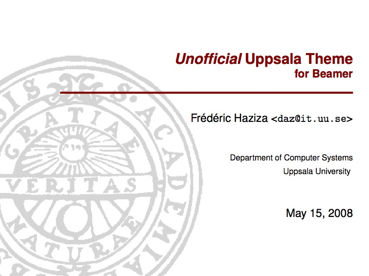
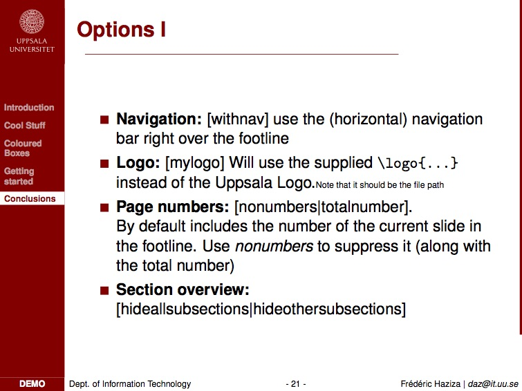
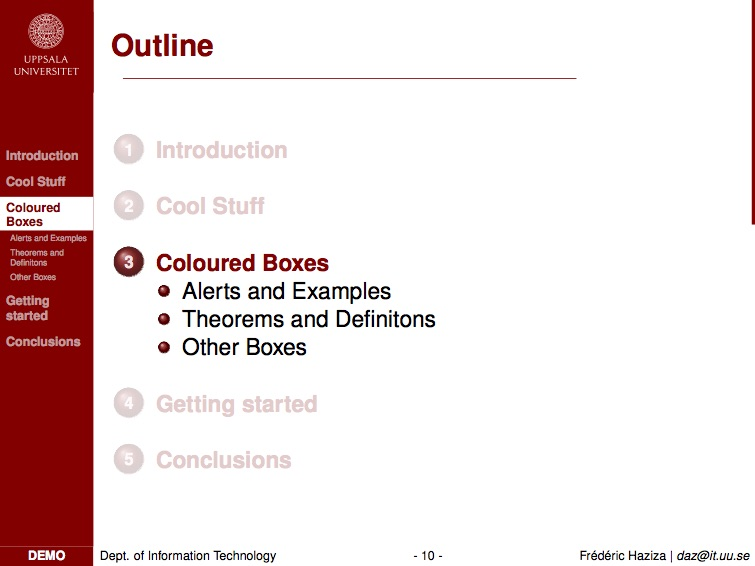
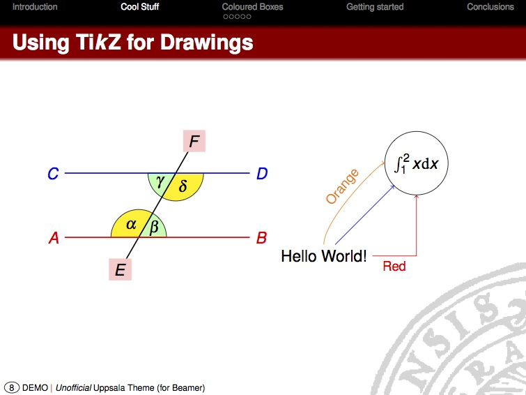
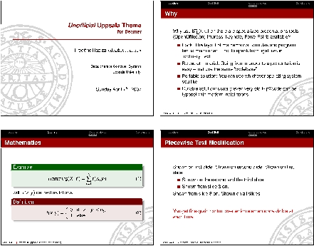

# _Unofficial_ Beamer Theme for Uppsala University

----
## Installation

* Download from GitHub
* Copy the files into `<beamer-location-in-your-tex-distribution>/themes/`
* Run `texhash` (probably as `root`)

----
## Background
There are several mode in beamer:
* A **beamer** mode, used for projector presentation
* A **handout** mode
* A **notes** mode, same as beamer but includes notes
* A **trans** mode, used for transparencies
* A **presentation** mode, that simply encompasses **beamer**, **handout** and **trans**.

Eventhough it is possible to specify several modes in the files that
you compile for a presentation, I have decided to create (and settle)
the **beamer**, **trans** and **handout** mode for the Uppsala
University theme. That is to say, you don't need to specify it
yourself, it is done within the Uppsala theme directly.

You consequently only need to specify the Uppsala theme, through

	\documentclass{beamer}
	\usetheme{Uppsala}

	\author[short version]{long version}
	\date[short version]{long version}
	\institute[short version]{long version}
	
	\begin{document}
	%% For the title
	\begin{frame}[plain]
	\titlepage
	\end{frame}
	...
	%% Oh, my first slide...
	\begin{frame}
	\frametitle{title here}
	%
	text here
	%
	\end{frame}
	...
	\end{document}

----
## Default

The hereabove code would use the default options for the theme: A red
sidebar with the menu under the logo of Uppsala University. In the
foot line, we would see the **short date**, the **short
institute** and the **short author**. The long version for author,
date, and institute would appear on the **title page**, beside a
grey logo of Uppsala University.

A title page with Uppsala beamer theme:

A bulleted frame with Uppsala beamer theme:

----
## Options

It is however possible to control few options.

`\usetheme[options]{Uppsala}` where _options_ is a comma-separated list of the following words:

* **numbers**: inserts the frame number in the footline (Note: it takes care of animations)
* **totalnumber**: inserts a slash and the total number of frames in the footline (Note: doesn't appear without the numbers option)
* **hideallsubsections**: removes the subsections from the menu, leaving only the top sections
* **hideothersubsections**: removes all subsections from the menu but the currently active section.
* **withnav**: inserts the navigation bar just above the short author (over the footline)
* **mylogo**: inserts the navigation bar just above the short author (over the footline)
* **noprogressbar**: hmmm guess...

I gave those options because I don't want to lock the theme according to my taste only, but I like these options:

	\usetheme[hideothersubsections,numbers,sidebarshades]{Uppsala}

For the sidebar layout:
* subsectionsattop, sectionpathattop,

----
## Handout mode

The handout mode is different. To access it, change the
`\documentclass{beamer}` to

	\documentclass[handout]{beamer}

It doesn't look like the default mode (ie the beamer mode). Nobody
needs the sidebar when we can have a quick look over all slides.  The
sidebar menu is used for long talks, like a lecture, which the
audience needs the keep track of.

This is why I choose a top bar menu, with top sections only, no
subsections and small bullets to show advancements. The color of the
menu is black. The title keeps as background the red from the
theme. The footline changes to **short date | title** without any
background.  I removed the institution, the author and the page number
since that information is not necessary on each page for this version
(Readers can find it on the **title page**)

With this theme, the usefull information is kept for the students'
handouts (and some space is gained on the side ... well ... little
space...)

It is advised though to combine the PDF output file with a
**pdfnup**, to create several slides per page. Beamer has such an
option, but I didn't get it to work, and pdfnup is pretty handy.

For a 2x2 slides handout:

	$ pdfnup --nup "2x2" --offset ".25cm .25cm" --delta ".25cm .5cm" --frame true --scale 0.9 beamerUppsalaExample.pdf

----
## Wish list

* Another mode: I would like to create a mode for "handout with blanks". The slides created through the handout would contain empty slots, where students can fill in the content that they see from the projector version.  I believe it to be a very good pedagogical help for students to get more _active learning_, than sitting in the class room and only listening to the presentation.
* A top menu version
* A grey sidebar theme
* Add a small white round dot for each section we come across in the progress bar.
* Create a horizontal progression bar at the top of the slides
* Removing the ugly warnings coming out of compilation, and eventhough they are rather harmless.
* Update the notes mode to reflect smarter use.
* Make sure that in plain mode, the sidebar width goes to size 0. That seems to be a bug in beamer itself.

----
## Final note

In case you plan on hacking it, don't forget to leave a little note in
your code, about where the theme comes from.

Enjoy the effort!

If things really don't work for you, fall back to the beamer-supplied
themes: I suggest Frankfurt for handouts and Copenhagen for beamer
presentation, where you can set the color to red.

----
Frédéric Haziza <daz@it.uu.se>
