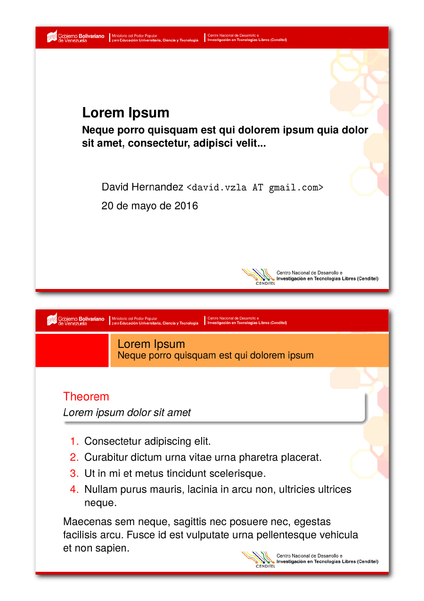

# cenditel-beamer-template
----
# Plantilla de presentaciones en Beamer (LaTeX) para CENDITEL

### Descargas
Debian y derivados: [cenditel-beamer-template_1.0_all.deb](https://github.com/davidhdz/cenditel-beamer-template/releases/download/v1.0/cenditel-beamer-template_1.0_all.deb)

### Uso
Agregar en el preámbulo la línea:
```TeX
\usetheme{cenditel}
```

### Ejemplo
La página inicial permite las siguientes etiquetas:
```TeX
% Preambulo
\documentclass{beamer}
\usepackage[utf8]{inputenc}
\usepackage[T1]{fontenc}

\usetheme{cenditel}

\title{Lorem Ipsum}
\subtitle{Neque porro quisquam est qui dolorem ipsum quia dolor sit amet, consectetur, adipisci velit...}
\date{\today}
\author{David Hernandez \texttt{<david.vzla AT gmail.com>}}

% Presentacion
\begin{document}

\begin{frame}
\titlepage
\end{frame}


\begin{frame}
\frametitle{Lorem Ipsum}
\framesubtitle{Neque porro quisquam est qui dolorem ipsum}
\begin{theorem}
Lorem ipsum dolor sit amet \end{theorem}
\begin{enumerate}
\item Consectetur adipiscing elit.
\item Curabitur dictum urna vitae urna pharetra placerat.
\item Ut in mi et metus tincidunt scelerisque.
\item Nullam purus mauris, lacinia in arcu non, ultricies ultrices neque.
\end{enumerate}

Maecenas sem neque, sagittis nec posuere nec, egestas facilisis arcu. Fusce id est vulputate urna pellentesque vehicula et non sapien.

\end{frame}

\end{document}
```


