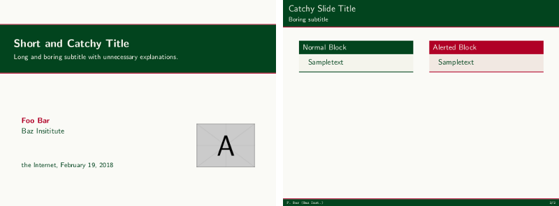
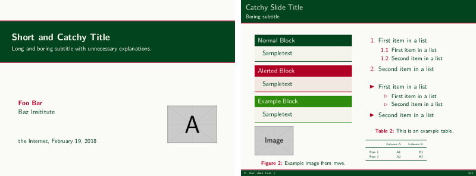
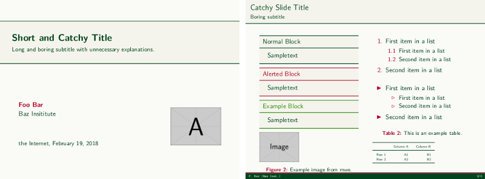
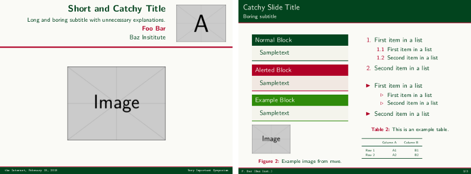
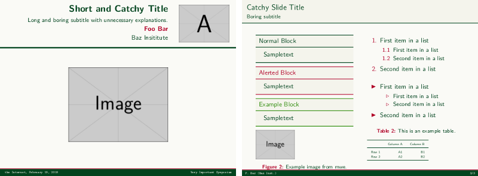

# latex-beamertheme-ibadai

This repository contains a theme for the documentclass
[`beamer`](https://ctan.org/tex-archive/macros/latex/contrib/beamer).
It is acompanied with a matching theme for a poster using
[`beamerposter`](https://ctan.org/tex-archive/macros/latex/contrib/beamerposter).

It is based on the colour-scheme, which is used by the university
I am currently employed by, Ibaraki University, Japan.

There are a few options, which can be used to change the layouts.
Demonstration files are comtained in [`/demo/`](./demo); 
for convenience, some screenshots are detailed below.

## Installation

Install the theme like you would install any other `.sty` 
by putting it somewhere, where your distribution can find it.
Most easily this is the source directory of the document 
which is going to be compiled.
Therefore the demonstration directory containes symbolic links
to the main directory's files.

## Usage

The following minimum working example exemplarily shows how to use this repository.

```
\documentclass[10pt]{beamer}

\usetheme{Mito}

\title{Short and Catchy Title}
\subtitle{Long and boring subtitle with unnecessary explanations.}
\author[F. Bar]{Foo Bar}
\institute[Baz Inst.]{Baz Insititute}
\titlegraphic{\includegraphics[scale=2]{example-image-a}}
% example-image from https://www.ctan.org/pkg/mwe
\date{the Internet, \today}

\begin{document}

\frame[plain]{\titlepage}

\begin{frame}[t]
\frametitle{Catchy Slide Title}
\framesubtitle{Boring subtitle}
\begin{columns}[T]
  \column{0.49\textwidth}
    \begin{block}{Normal Block}
      Sampletext
    \end{block}
  \column{0.49\textwidth}
    \begin{alertblock}{Alerted Block}
      Sampletext
    \end{alertblock}
\end{columns}
\end{frame}

\end{document}
```



## Options

There is a default (dark) colour scheme, and a light version.
An alternative titlepage can be requested.

The package also includes a style for a poster.

This is done by setting
```
\usetheme[option]{Mito}
```

### Default (dark colour scheme)

Without any options, the following general layout will be achieved:



### Light colour scheme

Invoking it with `light` will produce:


### Alternative title with dark colour scheme

Invoking it with `dark,alttitle` will produce


### Alternative title with dark colour scheme

Invoking it with `light,alttitle` will produce


### Poster

The poster style is invoked with `poster` and looks something like this:


---

I am not a professional, so this might be buggy - 
**use it at your own risk**.

Obviously you are free to adapt any of the contents and use it to your liking.
If you find bugs or unclean code, I would appreciate a note.

(Current: 2018-02-19; Martin)

