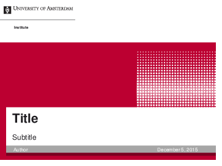
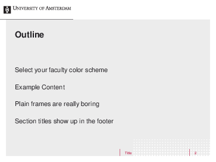
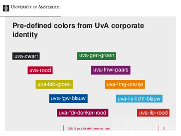
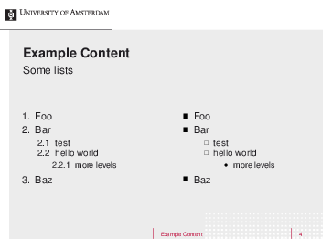
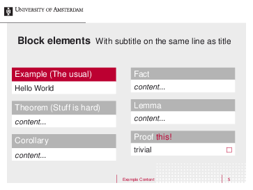
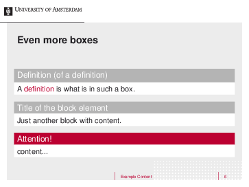
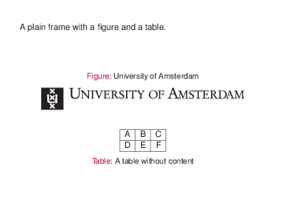

LaTeX beamer template *University of Amsterdam*
===============================================

This is a template for LaTeX beamer presentations according to the corporate
identity of the University of Amsterdam. All rights to the corporate identity
belong to the University of Amsterdam. Please refer to
[their style guide](https://extranet.uva.nl/en/a-z/content/corporate-communication/corporate-communication.html)
for further information.










Options
-------

The template allows customization of some degree.

The following parameters can be defined when loading the template with `\usetemplate`.

 * `logo` may be set to either `NL` or `ENG` (the default).
    This changes the name of the university in the header to either Dutch
    or English.
 * `maincolor` may be set to any color.
    This changes the background color of the title page and color of
    elements such as `alert`ed text, examples, and the footer.

Next to the regular template `University of Amsterdam` for `frametitle`s,
there is also a version which saves some space by placing both frame title
and subtitle on one line. It can be used with the following command:

```
\setbeamertemplate{frametitle}[University of Amsterdam oneline]
```

Have a look into the example presentation to see details.

Pre-defined colors
------------------

The corporate identity of the University of Amsterdam
[defines some colors](https://extranet.uva.nl/en/a-z/content/corporate-communication/corporate-identity-elements/colour/colour-kopie.html).
These colors are available when the template is loaded:

 * `uva-zwart`: general UvA Black
 * `uva-rood`: general UvA Red
 * `uva-feb-groen`: Green for Faculty of Economics and Business
 * `uva-fgw-blauw`: Blue for Faculty of Humanities
 * `uva-fdr-donker-rood`: Dark Red for Faculty of Law
 * `uva-gen-groen`: Green for Faculty of Medicine (AMC)
 * `uva-fnwi-paars`: Purple for Faculty of Science
 * `uva-fmg-oranje`: Orange for Faculty of Social and Behavioural Sciences
 * `uva-iis-licht-blauw`: Light Blue for Institute of Interdisciplinary Studies
 * `uva-ilo-rood`: Red for Interfacultaire Lerarenopleidingen

When used together with the `maincolor` option, these colors can help creating
a presentation which looks very similar to UvA's PowerPoint template.
Just set `maincolor` to the color of your faculty.

Issues
------

 * Only elements present in the example presentation have been tested.
   Any other elements might look horrible.
   Feel free to add your own styles and send me pull requests.
 * Files in `beamerthemeUniversityOfAmsterdam/` have to be kept in the
   working directory even when this theme is installed system wide.
   I've tried creating the logo and the background crosses in TikZ.
   However compiling presentations gets prohibitively long with them.

